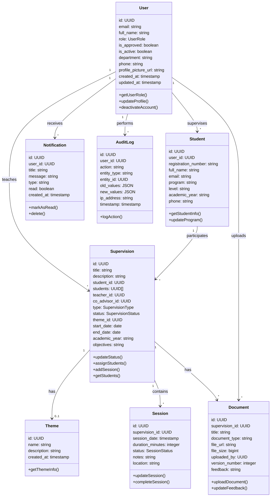
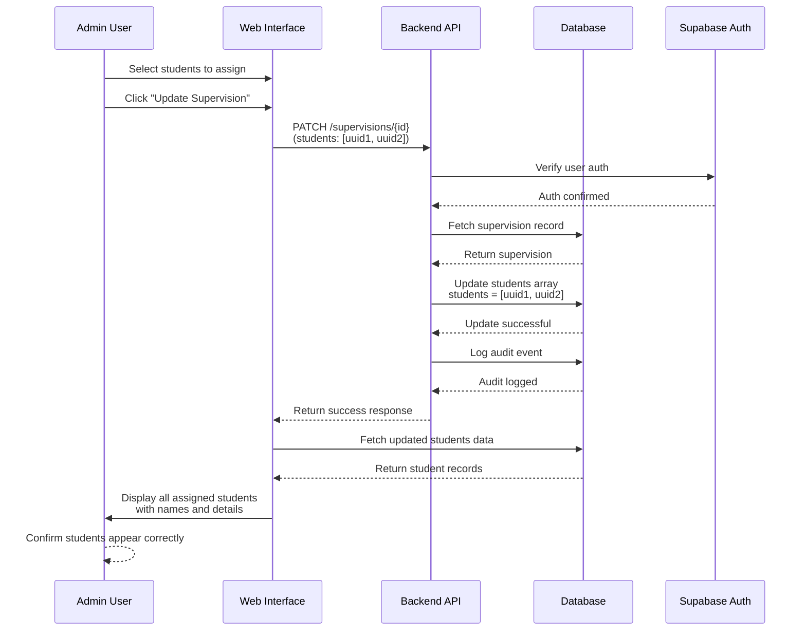
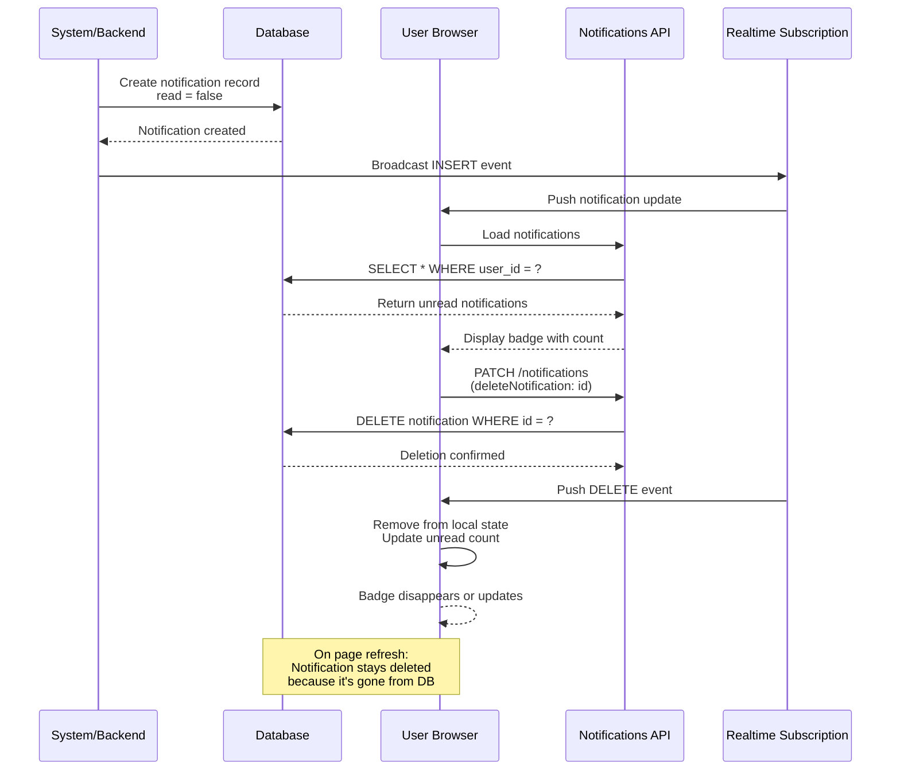

# LMCS - UML Diagrams

## 1. CLASS DIAGRAM

---

## 2. SEQUENCE DIAGRAM - Student Supervision Assignment

---

## 3. SEQUENCE DIAGRAM - Notification Lifecycle

---

## 4. USE CASE DIAGRAM

```mermaid
graph TB
    subgraph Admin["Admin Functions"]
        UC1["Create/Edit Users"]
        UC2["Manage Supervisions"]
        UC3["Generate Secret Codes"]
        UC4["View Audit Logs"]
        UC5["Approve User Requests"]
    end

    subgraph Director["Director Functions"]
        UC6["View All Supervisions"]
        UC7["Export Reports PDF"]
        UC8["View Statistics"]
        UC9["Monitor Assignments"]
    end

    subgraph Supervisor["Supervisor Functions"]
        UC10["View My Supervisions"]
        UC11["Update Supervision Status"]
        UC12["View Assigned Students"]
        UC13["Upload Documents"]
        UC14["Schedule Sessions"]
    end

    subgraph Student["Student Functions"]
        UC15["View My Supervisions"]
        UC16["Submit Documents"]
        UC17["View Feedback"]
        UC18["Track Progress"]
    end

    subgraph Common["Common Functions"]
        UC19["View Profile"]
        UC20["Change Password"]
        UC21["Receive Notifications"]
        UC22["Download/Export Data"]
    end

    Admin -.->|uses| UC2
    Director -.->|uses| UC6
    Supervisor -.->|uses| UC10
    Student -.->|uses| UC15
    
    UC2 -->|includes| UC22
    UC6 -->|includes| UC7
    UC10 -->|includes| UC13
    UC15 -->|includes| UC16
    
    Admin -.->|has| UC19
    Director -.->|has| UC19
    Supervisor -.->|has| UC19
    Student -.->|has| UC19
    
    UC19 -->|includes| UC20
    UC19 -->|includes| UC21

    style Admin fill:#ff9999
    style Director fill:#99ccff
    style Supervisor fill:#99ff99
    style Student fill:#ffcc99
    style Common fill:#e6e6e6
```

---

## Entity Relationships

### Users
- **Admin**: Full system control, manage users, approve requests
- **Supervisor**: Manage their supervisions, assign students
- **Director**: View all supervisions, generate reports

### Core Entities
- **Supervisions**: Link students with supervisors, track progress
- **Students**: Enrolled in supervisions, submit documents
- **Sessions**: Track supervision meetings and progress
- **Documents**: Store student work and feedback
- **Themes**: Research themes for supervisions
- **Notifications**: Keep users informed of updates

### Audit & Security
- **Audit Logs**: Track all system changes
- **Authentication**: Supabase Auth integration

---

## Data Flow Summary

1. **Supervision Creation**: Admin/Director creates supervision → assigns students → system creates notifications
2. **Student Assignment**: Admin selects multiple students → saves to `students` array → triggers notifications
3. **Status Updates**: Supervisor updates status → audit log created → notifications sent
4. **Document Upload**: User uploads → linked to supervision → notifications sent
5. **Notifications**: Created → stored in DB → displayed in bell → deleted when read
6. **Reporting**: Director exports → fetches all supervisions → generates PDF with student names
